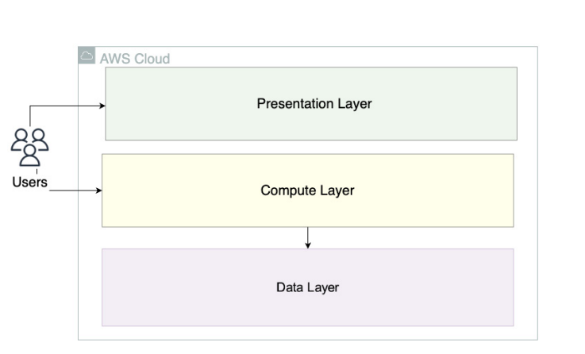
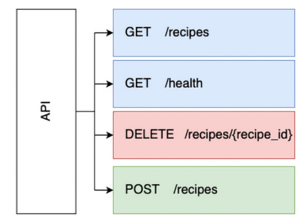
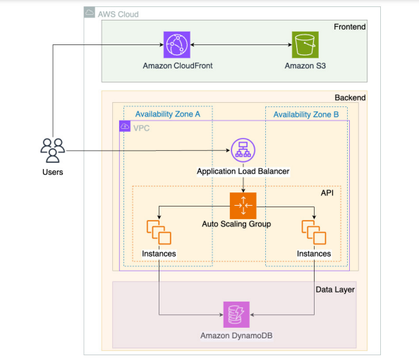

# Overview
We are going to build an application to share recipes using S3 and CloudFront for the frontend, EC2 to host our API and DynamoDB as the data store for the recipes. We are going to manage the infrastructure using Terraform as IaC.

# Requirements
This application will need to handle dynamic content inherent to recipe management. There are different key personas that will access the application:
 - Platform admin: The platform owner, who may want to create a new recipe, maintain it, or even delete it.
 - End users/consumers: The end user, who uses the platform for accessing a specific recipe, and should not be able to create, change, or delete any record.

## Functional requirements
The application should serve two different profiles: admins and end users.

### UI mockup home page

### Different functionalities and interfaces.
 - /user
    - Access the list of recipe titles
    - Ability to choose a specific recipe and access all the details.
    - Responsive.

    

 - /admin
    - Acess the list of recipe titles
    - Ability to delete recipes
    - Support recipe creation
    - Control the maximum amoutn of ingredients, steps, and recipes supported.
    - Responsive.

    

## Non-functional requirements.
We need to the following in terms of non-functional requirements:
 - Global distribution to serve users spread across the globe
 - Auto-scaling to handle the spiky usage pattern
 - Cost-effectiveness

## Technical requiremnts.
 - Modern frontend framework - React.js
 - Backend programming language - Python
 - FastAPI as the framework for API development.

## Data requirements
In our application, we are dealing with recipes, and there are several ways to store them. We do not
expect to run any complex queries over our data, and instead, we want to implement simple
operations to do the following:
 - List the recipes: Present a list of the recipes created.
 - Delete a recipe: If an admin no longer wants a specific recipe to be part of the portfolio, it should be possible to delete the item
 - Create a recipe: Create a new recipe to share with the users.

The structure of the recipe document will be:
**recipe_example.json:**
 - {
        "ID": "GUID",
        "Title": "recipe title",
        "Ingredients": [...],
        "Steps": [...]
 }

# Architecture
The figure below is an abstract diagram referencing the main layers that compose the full archtecture of our application.

End users interact with the presentation layer to get the frontend application, and perform requests to
the compute layer, but never access the data layer directly. Instead, the compute layer is responsible
for performing the data operations through an API.

## API design
Designing your API is crucial to ensure you use the right model to perform all the data operations
you will need, and both data and functional requirements should be taken into consideration.

Here's the breakdown:
 - GET /recipes: This gets the list of recipes
 - GET /health: This is a simple health check endpoint.
 - DELETE /recipes/{recipe_id}: This deletes a specific recipe with a defined ID.
 - POST /recipes: This creates a new recipe record

## Complete Architecture
For the frontend, we will use Amazon S3 and Amazon CloudFront to serve the application. The compute layer is implemented in Amazon EC2, and that's where we plan to deploy our API. For the data layer, we will use Amazon DynamoDB as our data store. For simplicity, we will group both the compute and data layers in a single layer called backend.
The complete archtecture should look like: 

