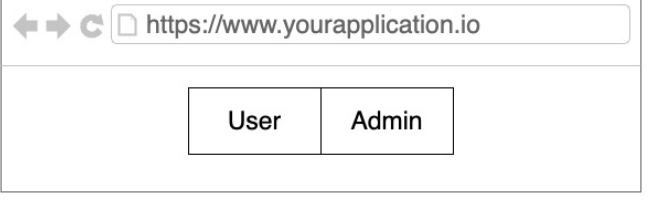
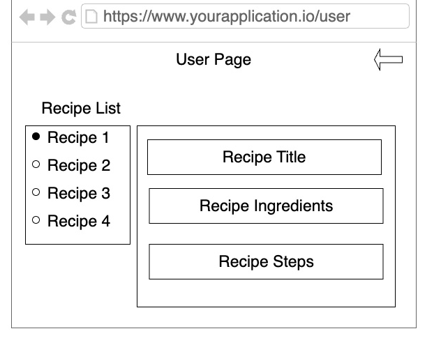
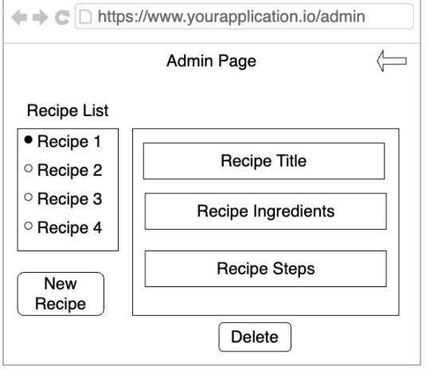

# Overview
We are going to build an application to share recipes using S3 and CloudFront for the frontend, EC2 to host our API and DynamoDB as the data store for the recipes. We are going to manage the infrastructure using Terraform as IaC.

# Requirements
This application will need to handle dynamic content inherent to recipe management. There are different key personas that will access the application:
 - Platform admin: The platform owner, who may want to create a new recipe, maintain it, or even delete it.
 - End users/consumers: The end user, who uses the platform for accessing a specific recipe, and should not be able to create, change, or delete any record.

## Functional requirements
The application should serve two different profiles: admins and end users.

### UI mockup home page

### Different functionalities and interfaces.
 - /user
    - Access the list of recipe titles
    - Ability to choose a specific recipe and access all the details.
    - Responsive.

    

 - /admin
    - Acess the list of recipe titles
    - Ability to delete recipes
    - Support recipe creation
    - Control the maximum amoutn of ingredients, steps, and recipes supported.
    - Responsive.
    
    

